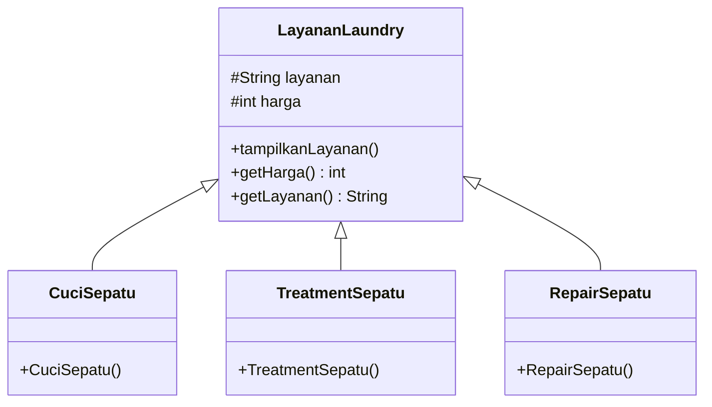

# 23_Laundry

# NAMA: JOSHUA TIMOTHY
# NIM : 2309116070

PENJELASAN STUDI KASUS

# 23_Laundry — Program Laundry Sepatu

Program **Laundry Sepatu** sederhana berbasis Java yang menerapkan konsep **Inheritance (Pewarisan)** dan **Polymorphism (Polimorfisme)**.

Program ini mensimulasikan pemesanan layanan laundry sepatu dengan tiga pilihan layanan, yaitu **Cuci Sepatu**, **Treatment Sepatu**, dan **Repair Sepatu**. Setiap layanan memiliki harga yang berbeda dan transaksi akan mengurangi saldo pengguna.

## 1. Penjelasan Studi Kasus

Studi kasus yang digunakan adalah sistem **pemesanan layanan laundry sepatu**.

Pengguna memiliki saldo awal sebesar **Rp200.000** dan dapat memilih salah satu dari tiga layanan:

| Pilihan | Layanan | Harga |
|---|---|---:|
| 1 | Cuci Sepatu | Rp50.000 |
| 2 | Treatment Sepatu | Rp70.000 |
| 3 | Repair Sepatu | Rp100.000 |

Setelah pengguna memilih layanan, program akan:

1. Membuat objek layanan sesuai pilihan pengguna.
2. Mengambil nama layanan dan harga melalui objek tersebut.
3. Memeriksa apakah saldo mencukupi.
4. Mengurangi saldo jika transaksi berhasil.
5. Menampilkan invoice transaksi.
6. Menanyakan apakah pengguna ingin memesan layanan lain.

Studi kasus ini dipilih karena setiap jenis layanan mempunyai **atribut dan perilaku dasar yang sama**, yaitu nama layanan dan harga, tetapi memiliki nilai yang berbeda. Hal tersebut cocok untuk menerapkan konsep **inheritance**.

---

## 2. Diagram Kelas / Hierarki Class

Hierarki class pada program dapat digambarkan sebagai berikut:



**Penjelasan hierarki:**

- `LayananLaundry` merupakan **parent class / superclass**.
- `CuciSepatu`, `TreatmentSepatu`, dan `RepairSepatu` merupakan **child class / subclass**.
- Ketiga subclass mewarisi atribut `layanan` dan `harga`, serta method dari `LayananLaundry`.
- Nilai layanan dan harga ditentukan pada constructor masing-masing subclass.

---

## 3. Penerapan Inheritance

Konsep **inheritance** diterapkan ketika class layanan turunan menggunakan `extends` untuk mewarisi class `LayananLaundry`.

Contoh pada `CuciSepatu.java`:

```java
class CuciSepatu extends LayananLaundry {

    public CuciSepatu() {
        layanan = "Cuci Sepatu";
        harga = 50000;
    }
}
```

Kata kunci:

```java
extends LayananLaundry
```

menunjukkan bahwa `CuciSepatu` merupakan turunan dari `LayananLaundry`.

Hal yang sama diterapkan pada class lainnya:

```java
class TreatmentSepatu extends LayananLaundry {
    public TreatmentSepatu() {
        layanan = "Treatment Sepatu";
        harga = 70000;
    }
}
```

```java
class RepairSepatu extends LayananLaundry {
    public RepairSepatu() {
        layanan = "Repair Sepatu";
        harga = 100000;
    }
}
```

Dengan inheritance, atribut dan method yang bersifat umum tidak perlu dibuat ulang pada setiap class layanan.

### Polimorfisme

Selain inheritance, program juga menerapkan **polymorphism** pada `Main.java` melalui referensi parent class:

```java
LayananLaundry layanan = null;
```

Kemudian referensi tersebut dapat menunjuk ke objek dari subclass yang berbeda:

```java
if (pilihan == 1) {
    layanan = new CuciSepatu();
} else if (pilihan == 2) {
    layanan = new TreatmentSepatu();
} else if (pilihan == 3) {
    layanan = new RepairSepatu();
}
```

Meskipun tipe referensinya adalah `LayananLaundry`, objek yang digunakan dapat berupa `CuciSepatu`, `TreatmentSepatu`, atau `RepairSepatu`.

Contohnya, kode berikut dapat digunakan untuk mengambil harga dari objek yang dipilih:

```java
int harga = layanan.getHarga();
```

---

## 4. Screenshot Running Program

Berikut contoh hasil ketika program dijalankan dan pengguna memilih layanan **Cuci Sepatu**:


![Screenshot Running Program]


Contoh alur transaksi:

- Saldo awal: **Rp200.000**
- Memilih Cuci Sepatu: **Rp50.000**
- Saldo setelah transaksi: **Rp150.000**

---

## 5. Struktur Project

```text
23_Laundry/
├── src/
│   └── pkg23_laundry/
│       ├── Main.java
│       ├── LayananLaundry.java
│       ├── CuciSepatu.java
│       ├── TreatmentSepatu.java
│       └── RepairSepatu.java
└── README.md
```

## 6. Cara Menjalankan Program

Pastikan Java/JDK sudah terpasang, kemudian compile file Java:

```bash
javac -d build/classes src/pkg23_laundry/*.java
```

Jalankan program dengan:

```bash
java -cp build/classes pkg23_laundry.Main
```

---

## Kesimpulan

Program `23_Laundry` merupakan contoh sederhana penerapan **Object-Oriented Programming (OOP)** pada Java. Konsep **inheritance** digunakan untuk membuat beberapa jenis layanan yang berasal dari satu class induk, sedangkan **polymorphism** digunakan agar satu referensi `LayananLaundry` dapat digunakan untuk berbagai objek layanan.
